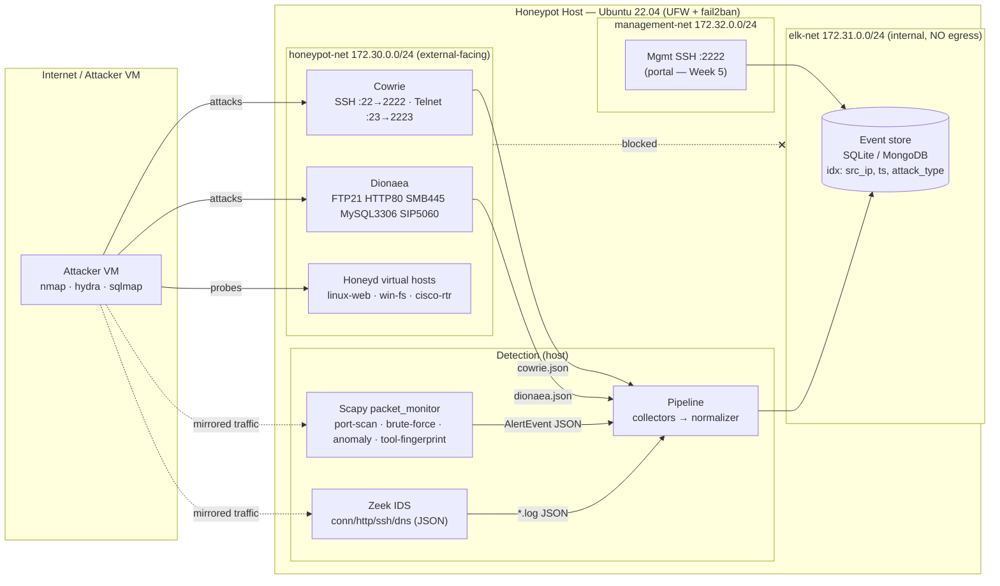

# NeuroTrap / CADN — Network & Data-Flow Diagram (Week 1, Day 7)

Lab topology and the three isolated Docker networks, plus how captured data flows
through the Week 1–2 layers into the event store.

## Network topology

## Isolation guarantees (verified Day 2 / Day 7)
- **honeypot-net** is the only externally-exposed segment; the honeypots live here.
- **elk-net** is `internal: true` (no internet egress) and holds the event store.
- **management-net** carries the portal/enrichment + the real admin SSH on **2222**.
- A compromised honeypot **cannot** reach the database: the DB container is attached
  only to `elk-net` + `management-net`, never `honeypot-net`.
- Host firewall (UFW) allows only the honeypot ports + mgmt SSH 2222; fail2ban
  guards 2222.

## Port map
| Service | Host port | Container | Purpose |
|---|---|---|---|
| Cowrie SSH | 22 | 2222 | SSH honeypot (real admin SSH moved to 2222) |
| Cowrie Telnet | 23 | 2223 | Telnet honeypot |
| Dionaea | 21/80/445/3306 + 5060/udp | same | FTP/HTTP/SMB/MySQL/SIP malware collector |
| Mgmt SSH | 2222 | — | Administration (fail2ban-protected) |

## Data flow (Layers 1→2)
1. **Capture (L1):** Cowrie, Dionaea, Honeyd accept attacker connections and write
   structured JSON.
2. **Detection (L2):** Scapy monitor raises `port_scan` / `brute_force` /
   `protocol_anomaly` / `automated_tool` alerts; Zeek logs conn/http/ssh/dns.
3. **Normalize:** collectors tail every source; the normalizer maps each into the
   unified `AlertEvent` schema (also fingerprinting tools from UA / SSH banners).
4. **Store:** events are written to SQLite/MongoDB, indexed on `src_ip`,
   `timestamp`, `attack_type` — ready for the Week-3 behavior engine.
